<div align="center">

# 🎵 **Mei**

### 「一个仍在成长，但更新随缘的第三方网易云音乐播放器」


</div>

---

## 📖 项目介绍

Mei 是一款使用 **Jetpack Compose** 开发的 **网易云音乐第三方客户端**。
本来计划保持稳定更新来着，但 ***~~上上个~~*9月的时候分手了**，~~难受ing~~ 😔
现在的状态大概是：

> **遇到 Bug 欢迎提 Issue 🚀**
> **更新？全看缘分 🤷‍♂️**

毕竟：

* 📚 学业太重（大三，备考中……）
* 🌧 生活太乱
* 💔 世界好像也有点荒凉

不过 Mei 还活着，而且能用（应该算好消息？🙂）

---

## ✅ 功能进展

### 🎧 已实现

* 🎙 逐字歌词（支持：**网易云** / **99音乐** / **TMLL**）
* 📜 播放列表管理
* ❤️ 喜欢音乐
* 🔀 随机播放 & 播放顺序优化
* 🕒 定时播放
* 🧾 历史播放记录
* 💿 专辑详情页
* 🖼 自选背景 & 个人中心 UI 迭代

---

### 🔧 TODO 清单

| 任务         | 状态     |
| ---------- | ------ |
| 🔍 搜索功能    | ✅ 已完成  |
| 👤 播放记录    | ✅ 已添加  |
| 🎼 性能优化    | ✅ 持续中  |
| 🎧 专辑页面    | ✅ 已完成  |
| 📑 歌单管理    | ✅ 部分覆盖 |
| 🧑‍🎤 歌手主页 | ⏳ 规划中  |
| 📻 FM 播放   | ⏳ 未来计划 |
| 💗 红心模式    | ⏳ 未来计划 |
| 🎵 FM 私人推荐 | ⏳ 开发中  |

> ✔ = 已完成 ｜ ⏳ = 未来更新（不保证啥时候）🙂

---

## 🍪 登录说明

⚠️ **本软件目前仅支持 Cookie 登录**

* 只需要 `MUSIC_U` 字段的 **值**
* ⚠️ 仅保留纯值 `xxxxx`，不要包含 `cookie=`, `MUSIC_U=`, `;`, `空格`, `其它字段` 等内容

✅ 正确示例：

```
xxxxx（仅纯值）
```

❌ 以下仍然**错误**的：

```
cookie=MUSIC_U=xxxxx
MUSIC_U=xxxxx
cookie: MUSIC_U=xxxxx;
```

### 🔑 获取方式

1. 通过 **网页版登录网易云**
2. 打开浏览器开发者工具（F12）
3. 在任意请求的 Request Header 中找到 `MUSIC_U`
4. 复制它的 **纯值** 即可 ✅
5. Cookie 一般长期有效，无需频繁更新

---

## 📣 最新公告（开发碎碎念）

* ❌ 下载功能已移除（本来就用不了，不如直接删 🫤）
* ❌ 动态背景暂时禁用（太卡了 🥲）
* 🧎 部分 UI 重构（Library 加入历史播放 + 交互优化）
* 🎵 99音乐逐字歌词回归（隐藏在 `+` 里，懂的都懂）
* ✅ 随机播放修复
* ✅ 一些小细节更新（期待？我也期待 🤨）
* 换了一个logo 感觉好丑，但是设计好像还行，颜色太丑了，来个佬给我弄一下

---

## 🙏 开源致谢

感谢以下两位开源圣人（真的强 🧎‍♂️）：

* 提供高质量歌词库 → **amll-ttml-db**
* 提供精美歌词组件 → **accompanist-lyrics-ui**

> 你们开源，我直接快乐（虽然没完全快乐，毕竟荒凉 🙂‍↕️）

---

## 🪲 BUG 记录

| BUG               | 状态            |
| ----------------- | ------------- |
| 🎼 歌词界面切歌稳定触发 ANR | ✅ 大部分缓解，但原因不明 |
| 🔀 播放顺序错误         | ✅ 已修复         |
| 🔍 搜索界面展示异常       | ✅ 已修复         |

---

## 📸 软件界面预览

> 更多截图请看仓库 `screenshot` 目录 👇

```
screenshot
```

<!-- 你的原截图表格保留 ↓ -->

<table>
  <tr>
    <td>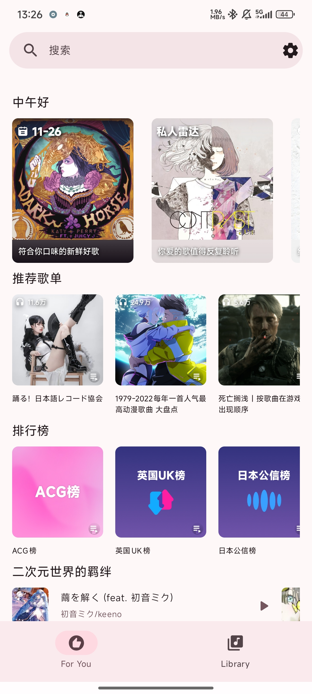</td>
    <td>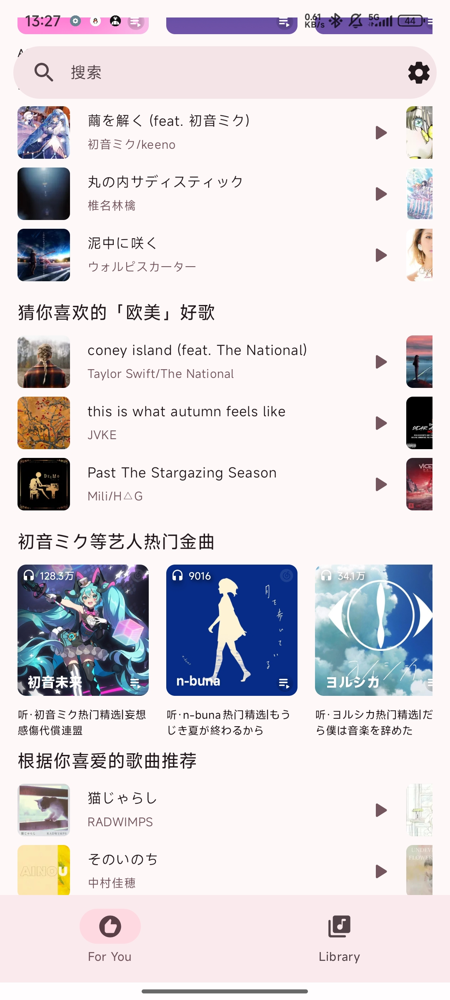</td>
    <td>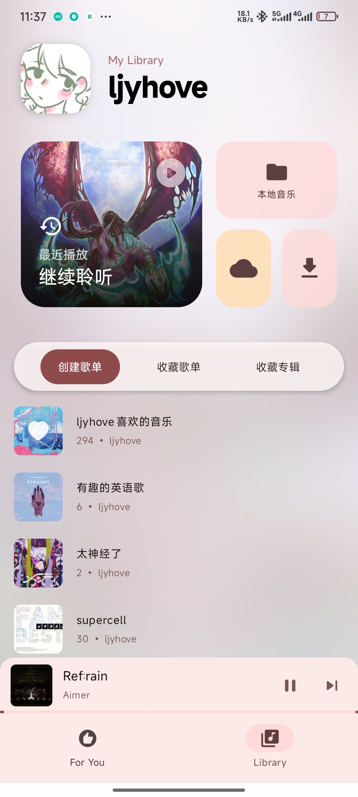</td>
    <td>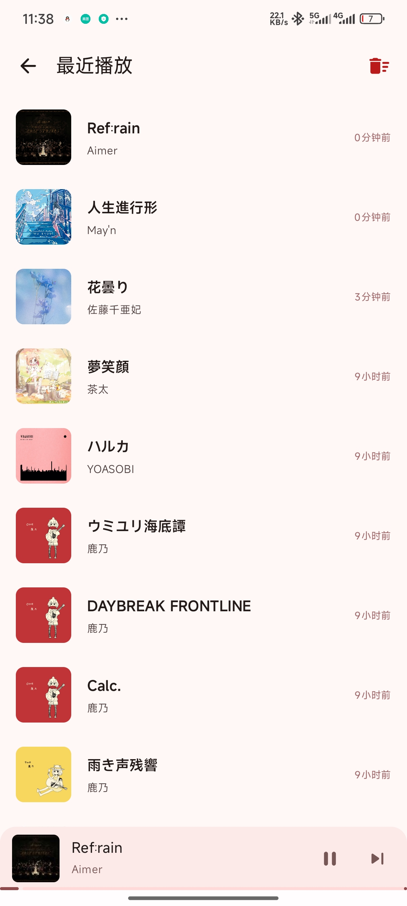</td>
  </tr>
  <tr>
    <td>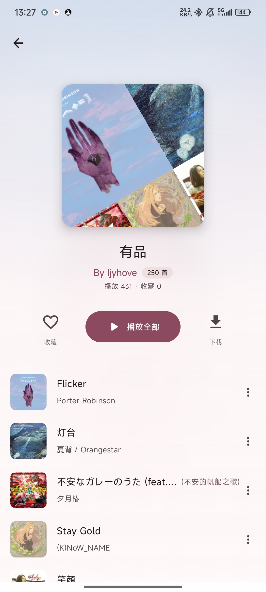</td>
    <td>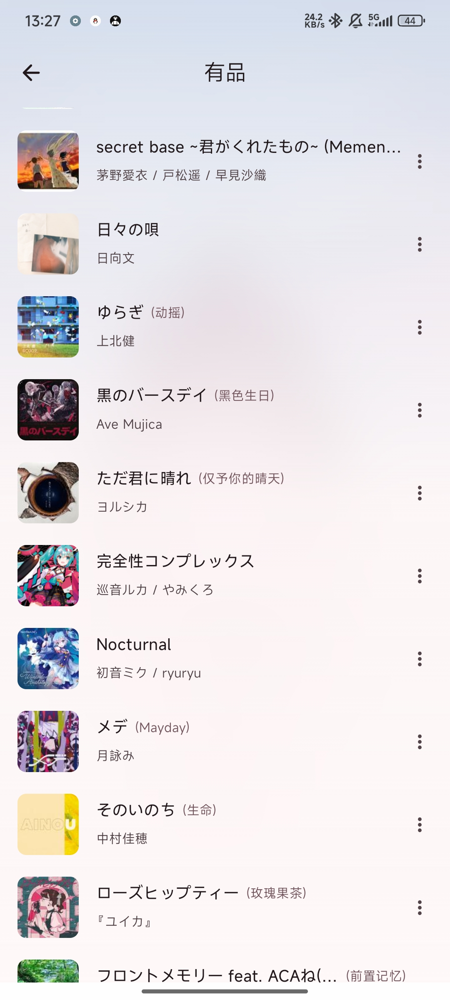</td>
    <td>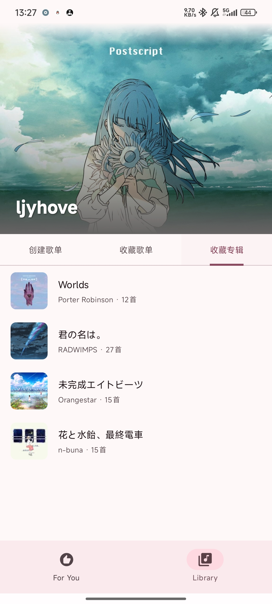</td>
    <td>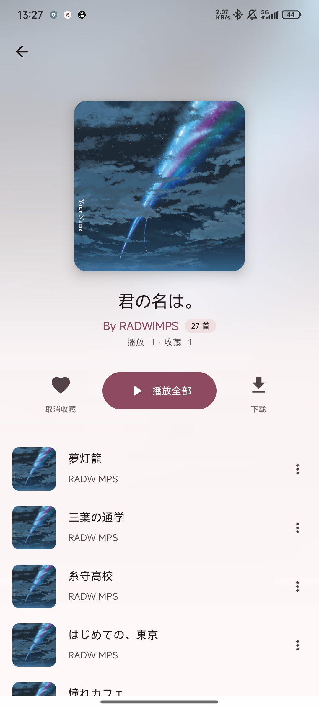</td>
  </tr>
  <tr>
    <td>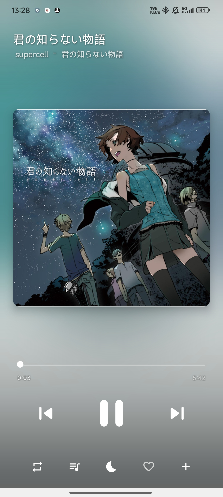</td>
    <td>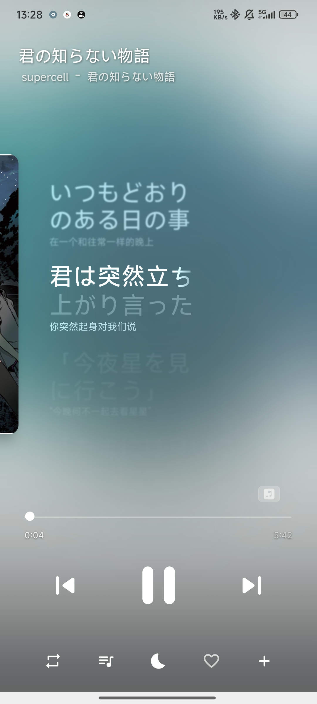</td>
    <td>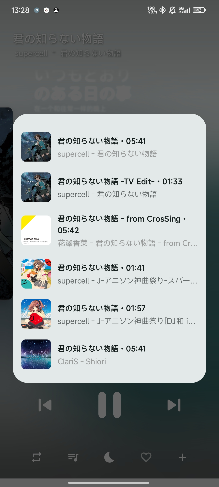</td>
    <td>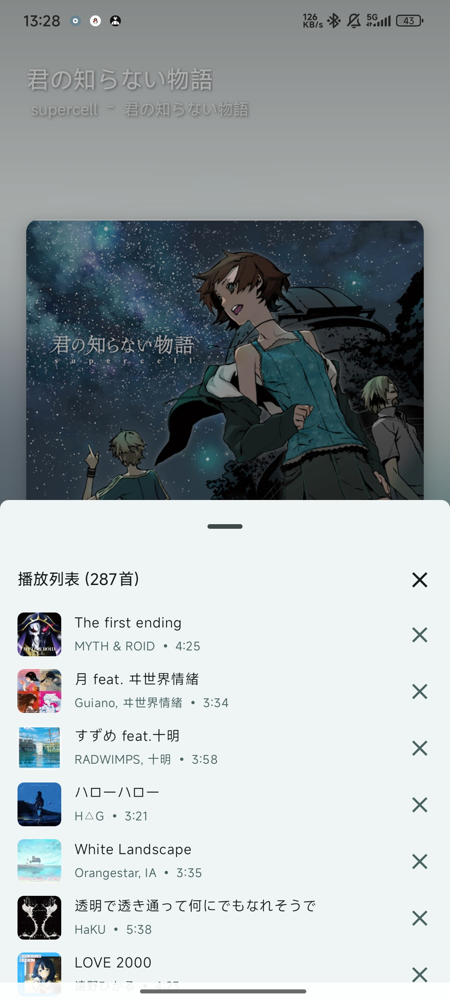</td>
  </tr>
  <tr>
    <td>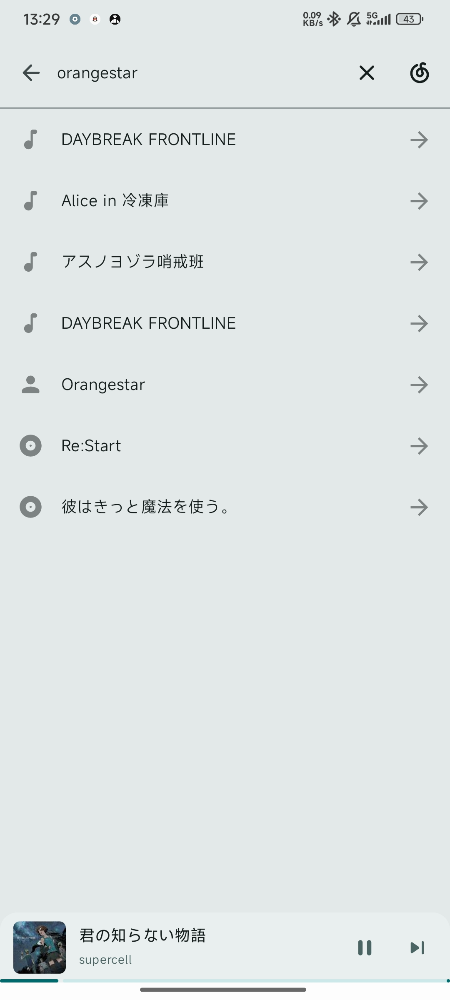</td>
    <td>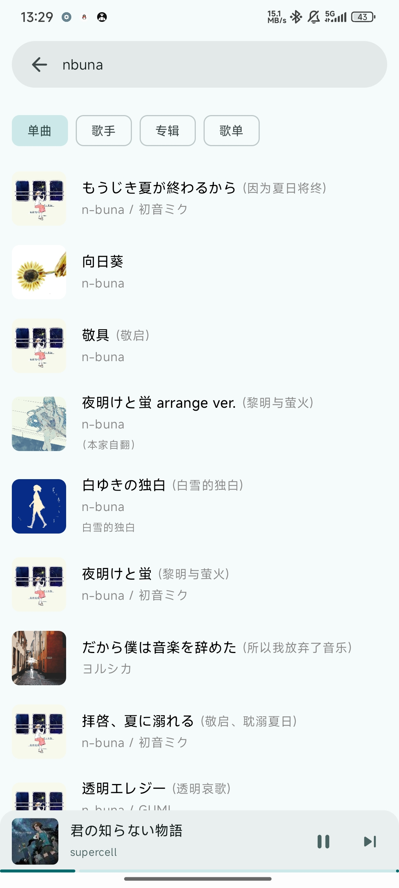</td>
    <td>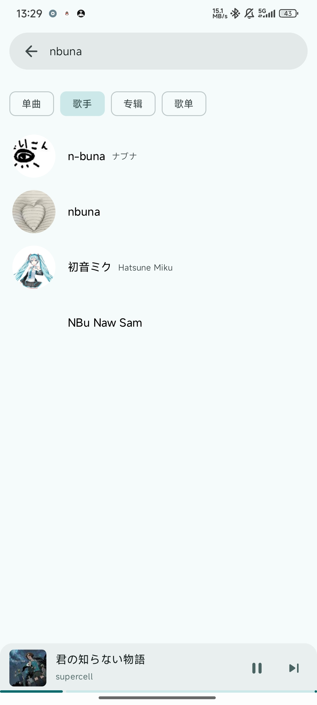</td>
    <td>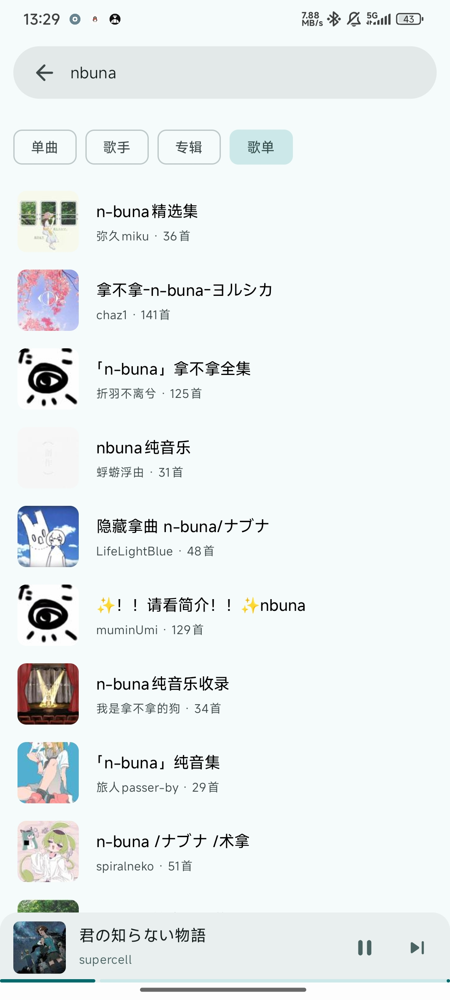</td>
  </tr>
</table>

---

## 🌟 写在最后

嗯… 可能真的有点荒凉。
但如果你读到这里，谢谢你。

Mei 还在写、还能听歌、歌词还能逐字滚动、感情虽然滚动不了了但代码还能动。
就… 挺好。🙂

你猜为什么叫做Mei？

---