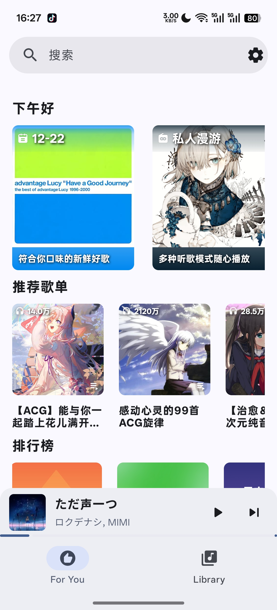
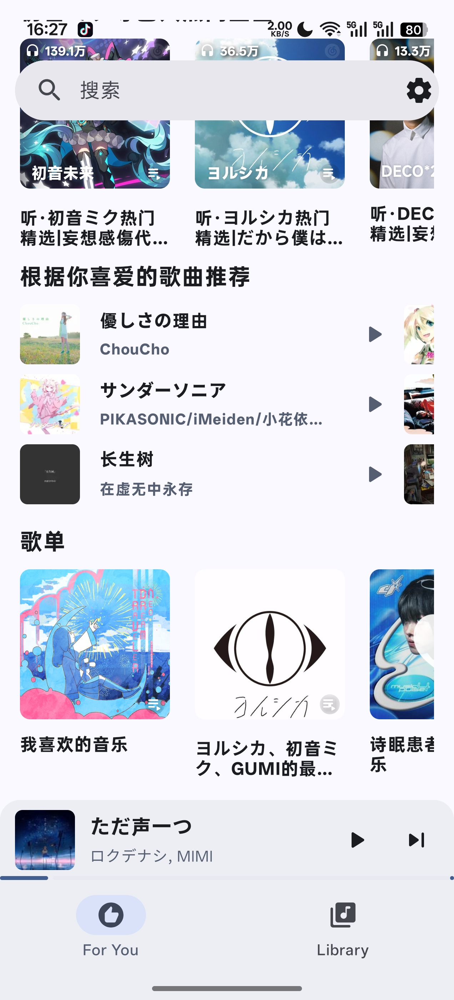
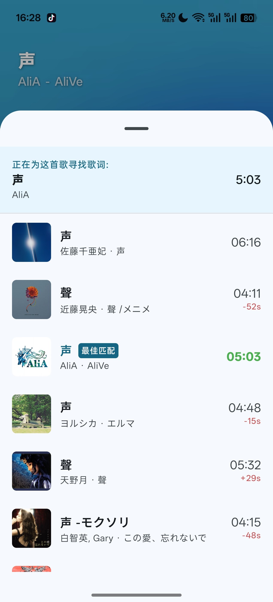

<div align="center">

# Mei

### 一个仍在成长，但更新随缘的第三方网易云音乐播放器


</div>

---

## 项目介绍

Mei 是一款使用 **Jetpack Compose** 开发的 **网易云音乐第三方客户端**。
本来计划保持稳定更新来着，但 9月的时候分手了 ，然后现在需要备考，所以暂时不会出现重大更新了(等我毕业旅行结束才会有新功能)😔
现在的状态大概是：

> **遇到 Bug 欢迎提 Issue**
> **更新？全看缘分**
> **遇到错误可以通过日志反馈的issue中，过段时间我会集中处理**
---

## 功能进展

### 已实现

* 逐字歌词（支持：**网易云** / **99音乐** / **TMLL**）
* 播放列表管理(应该比较稳定)
* 喜欢音乐(似乎能用，但是不太稳定)
* 随机播放 & 播放顺序优化(算是稳定吧，修复了很多次)
* 定时播放
* 历史播放记录(本地存储)
* 专辑详情页
* 自选背景 & 个人中心 UI 迭代

---

### TODO 清单

| 任务         | 状态   |
| ---------- |------|
| 搜索功能    | 已完成  |
| 播放记录    | 已添加  |
| 性能优化    | 持续中  |
| 专辑页面    | 已完成  |
| 歌单管理    | 已完成  |
| 歌手主页 | 已完成  |
| FM 播放   | 未来计划 |
| 红心模式    | 未来计划 |
| FM 私人推荐 | 未来计划  |

> 已完成 | 未来更新（不保证啥时候）

---

## 登录说明

⚠️ **本软件目前仅支持 Cookie 登录**

* 只需要 `MUSIC_U` 字段的 **值**
* ⚠️ 仅保留纯值 `xxxxx`，不要包含 `cookie=`, `MUSIC_U=`, `;`, `空格`, `其它字段` 等内容

✅ 正确示例：

```
xxxxx（仅纯值）
```

❌ 以下仍然**错误**的：

```
cookie=MUSIC_U=xxxxx
MUSIC_U=xxxxx
cookie: MUSIC_U=xxxxx;
```

以后可能会考虑添加更多登录方式，比如扫码、密码登录。

### 获取方式

1. 通过 **网页版登录网易云**
2. 打开浏览器开发者工具（F12）
3. 在任意请求的 Request Header 中找到 `MUSIC_U`
4. 复制它的 **纯值** 即可 ✅
5. Cookie 一般长期有效，无需频繁更新

---

## 最新公告（开发碎碎念）
* 添加了日志收集功能，不过崩溃依旧会闪退哦。大丈夫ですよ
* 优化了qq音乐搜索、以及部分界面
* 注意，在播放列表大于1000或者500(具体我也不知道)会无法播放或者播放器崩溃，~~准备修复~~，已修复。
* 添加了一些细节，V1.45更新
* 下载功能已移除（本来就用不了，不如直接删）
* 动态背景暂时禁用（太卡了）
* 部分 UI 重构（Library 加入历史播放 + 交互优化）
* 99音乐逐字歌词回归（隐藏在 `+` 里，懂的都懂）
* 随机播放修复
* 一些小细节更新（期待？我也期待）
* 换了一个logo，感觉好丑，但是设计好像还行，颜色太丑了，来个佬给我弄一下


### 2025-12-01
记录一下最近观察到的bug或者异常
- 长时间运行软件，播放的歌曲好像会出现vip限制，就是vip音乐只有45秒
- 歌词组件问题还比较多，有些时间不会滚动，歌词的显示也有点问题。其次就是播放现在这个设计留给歌词的空间不是很多，后续大概会调整播放界面。
- 播放的时候莫名其妙的闪退，这个后续我会添加一个收集异常的功能。比如添加到播放列队的时候
- qq音乐歌词有些时候不会触发，这个也很奇怪，少见。一般来说清除软件数据就可以解决。


---

## 开源致谢

感谢以下两位开源圣人：

* 提供高质量歌词库 → **amll-ttml-db**
* 提供精美歌词组件 → **accompanist-lyrics-ui**


---

## BUG 记录

| BUG                              | 状态  |
|----------------------------------|-----|
| 在播放列表大于1000的时候会无法播放或者崩溃 | 已修复 |
| 歌词界面切歌稳定触发 ANR                   | 已修复 |
| 播放顺序错误                           | 已修复 |
| 搜索界面展示异常                         | 已修复 |

---

## 软件界面预览

> 更多截图请看仓库 `screenshot` 目录

```
screenshot
```

<table>
  <tr>
    <td></td>
    <td></td>
    <td></td>
    <td></td>
  </tr>
  <tr>
    <td></td>
    <td></td>
    <td></td>
    <td></td>
  </tr>
  <tr>
    <td></td>
    <td></td>
    <td></td>
    <td></td>
  </tr>
  <tr>
    <td></td>
    <td></td>
    <td></td>
    <td></td>
  </tr>
</table>

---

## 写在最后

嗯… 可能真的有点荒凉。但如果你读到这里，谢谢你。

Mei 还在写、还能听歌、歌词还能逐字滚动、感情虽然滚动不了了但代码还能动。让我们坚信，**我们终将相遇**。


Mei 2025(梅)

---