<div align="center">

# Mei

### 一个仍在成长，但更新随缘的第三方网易云音乐播放器


</div>

---
## 项目介绍

Mei 是一款使用 **Jetpack Compose** 开发的 **网易云音乐第三方客户端**。

好久不见，最近会整合代码，并带来一些新UI，比如将applemusic-like-lyric那样的效果迁移到本项目中(已经实现，不过一些gpu处理器会出现bug，希望大家能够针对贡献一些pr)

** v1.54** 还有一些bug(比如进入全屏播放器有闪烁，player bar 消失，流体玻璃的适配等问题)，会在近期发布修复版本
<table>
  <tr>
    <td>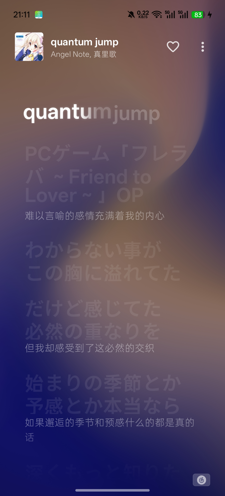</td>
    <td>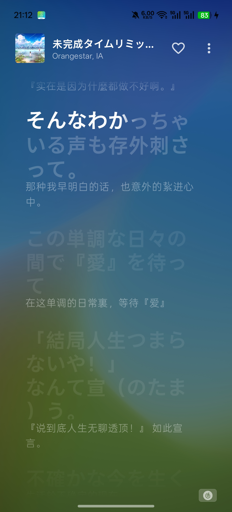</td>
    <td>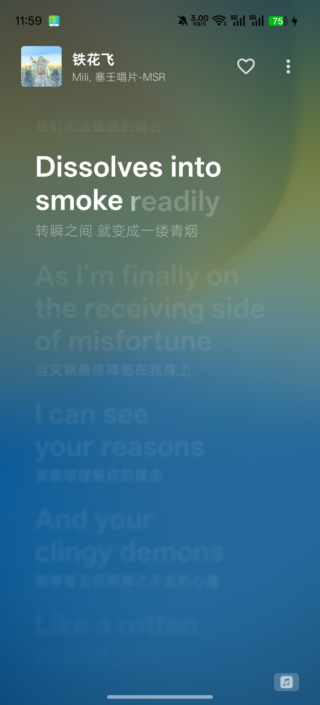</td>
  </tr>
</table>
---

## 功能进展

### 已实现

* 逐字歌词（支持：**网易云** / **99音乐** / **TMLL**）
* 播放列表管理
* 喜欢音乐
* 随机播放 & 播放顺序优化
* 定时播放
* 历史播放记录(本地存储)
* 专辑详情页
* 自选背景 & 个人中心 UI 迭代

---

## 登录说明

⚠️ **本软件目前仅支持 Cookie 登录**

* 只需要 `MUSIC_U` 字段的 **值**
* ⚠️ 仅保留纯值 `xxxxx`，不要包含 `cookie=`, `MUSIC_U=`, `;`, `空格`, `其它字段` 等内容

✅ 正确示例：

```
xxxxx（仅纯值）
```

❌ 以下仍然**错误**的：

```
cookie=MUSIC_U=xxxxx
MUSIC_U=xxxxx
cookie: MUSIC_U=xxxxx;
```

以后可能会考虑添加更多登录方式，比如扫码、密码登录。

### 获取方式

1. 通过 **网页版登录网易云**
2. 打开浏览器开发者工具（F12）
3. 在任意请求的 Request Header 中找到 `MUSIC_U`
4. 复制它的 **纯值** 即可 ✅
5. Cookie 一般长期有效，无需频繁更新

---


## 开源致谢

感谢以下几位开源圣人：

* 提供高质量歌词库 [amll-ttml-db](https://github.com/Steve-xmh/amll-ttml-db)
* 提供精美歌词组件 [accompanist-lyrics-ui](https://github.com/6xingyv/accompanist-lyrics-ui.git)
* 提供qrc解密算法 [qrcDecrypt](https://github.com/TLittlePrince/qrcDecrypt)
* 提供流体玻璃效果 [AndroidLiquidGlass](https://github.com/Kyant0/AndroidLiquidGlass)


## 软件界面预览

> 更多截图请看仓库 `screenshot` 目录

```
screenshot
```

<table>
  <tr>
    <td>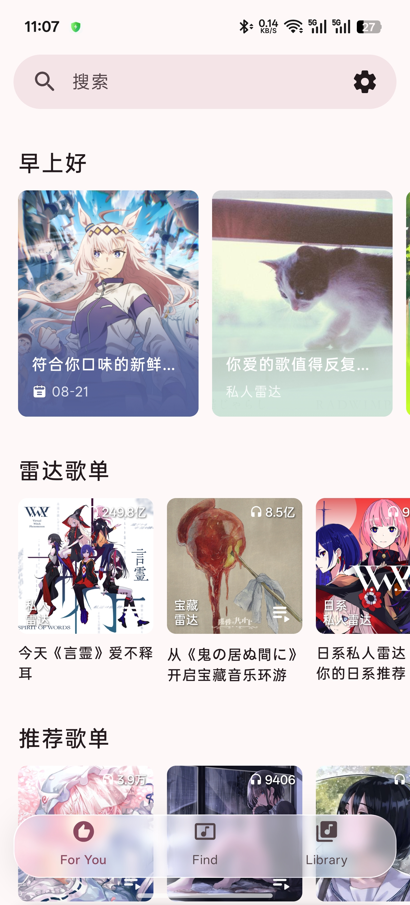</td>
    <td>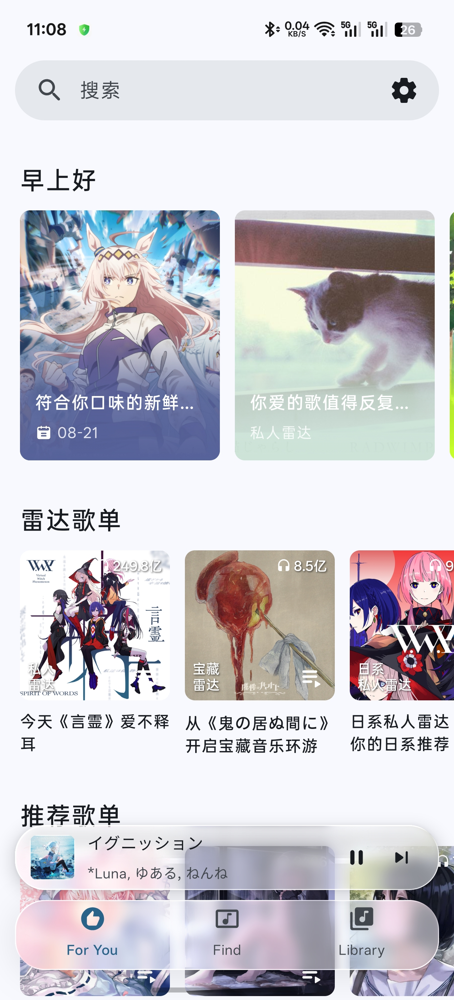</td>
    <td>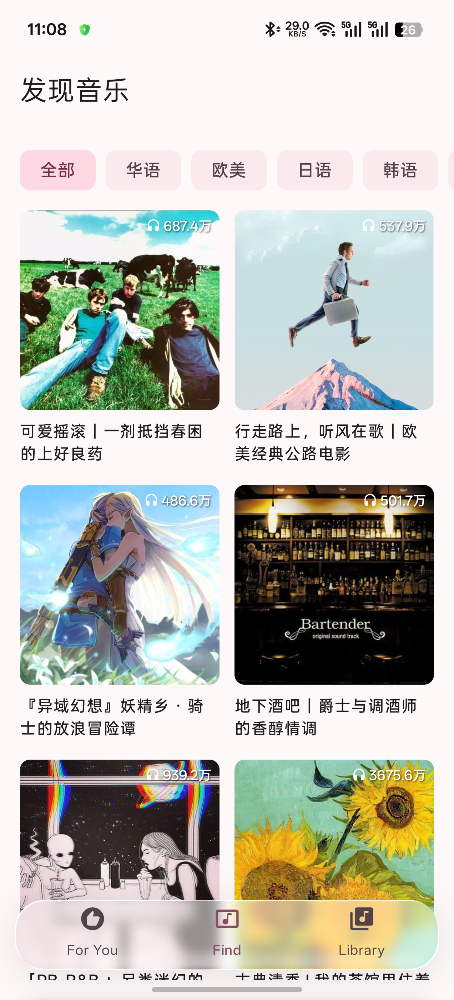</td>
  </tr>
  <tr>
    <td>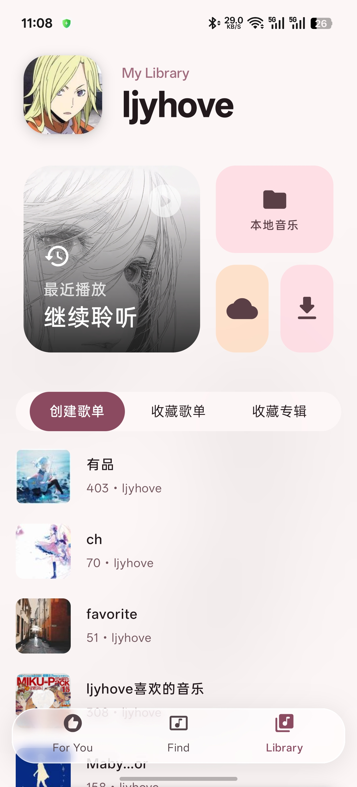</td>
    <td>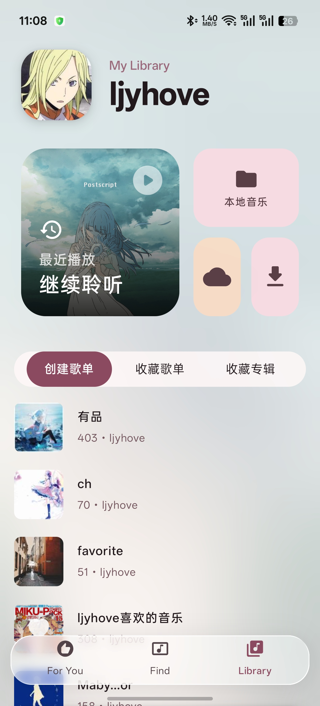</td>
    <td>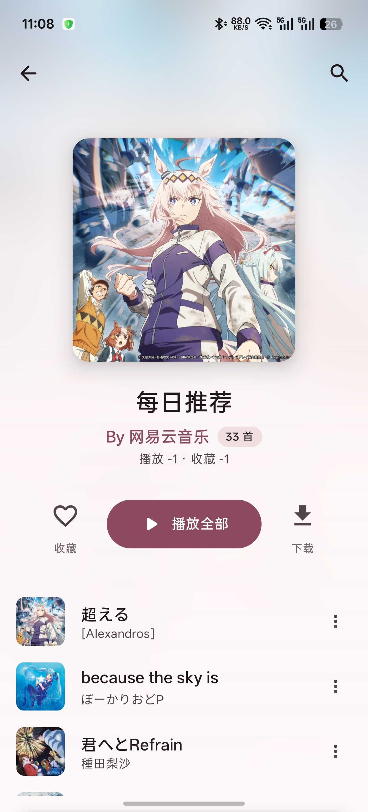</td>
  </tr>
  <tr>
    <td>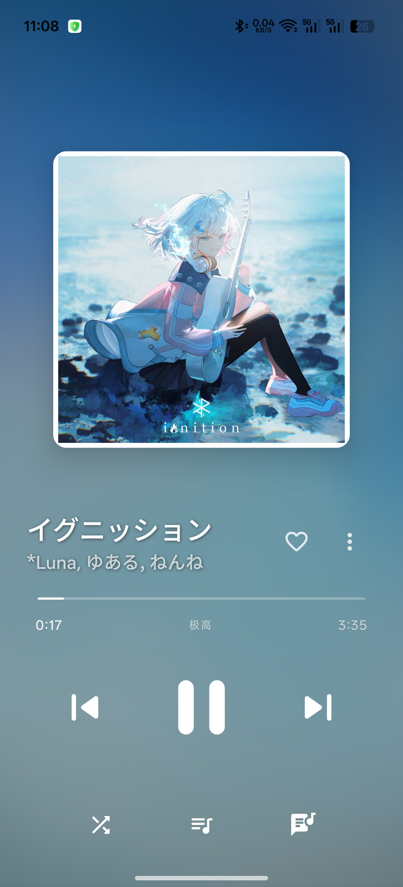</td>
    <td>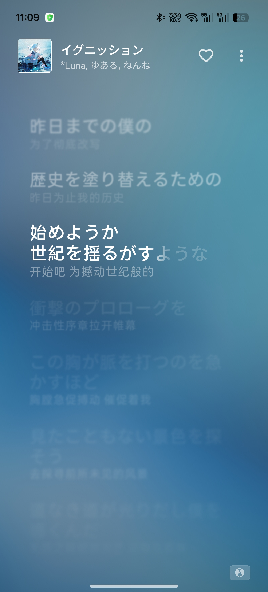</td>

  </tr>
  <tr>
    <td>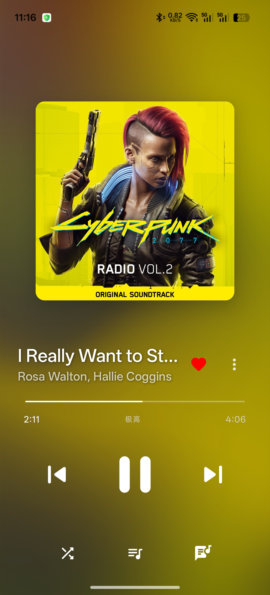</td>
    <td>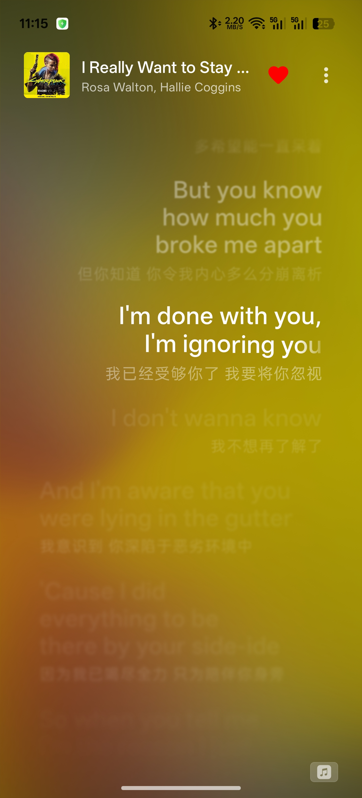</td>
  </tr>

  <tr>
    <td>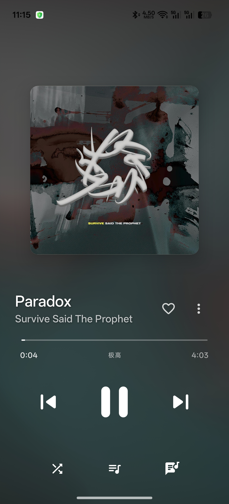</td>
    <td>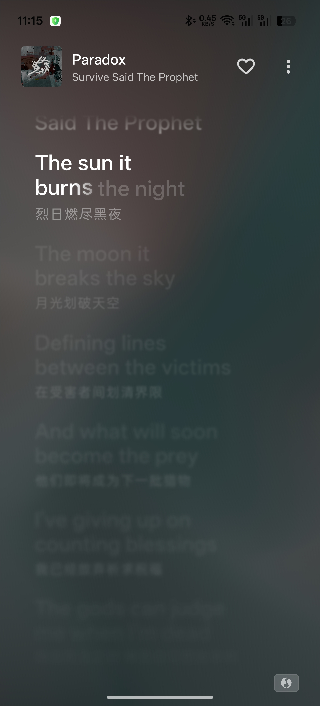</td>
  </tr>
</table>

---


## 写在最后

嗯… 可能真的有点荒凉。但如果你读到这里，谢谢你。

Mei 还在写、还能听歌、歌词还能逐字滚动、感情虽然滚动不了了但代码还能动。让我们坚信，**我们终将相遇**。


Mei 2025(梅)

---
