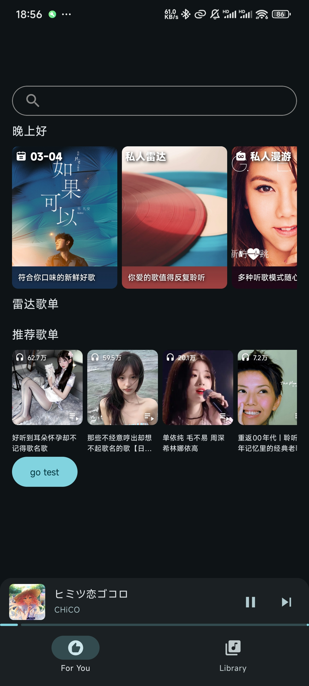

# Mei

一个网易云第三方音乐软件，软件仍然在开发中，不过上个月分手了，难受ing。

如果有什么问题，欢迎提issue。不过更新的话就随缘了。

学业、生活上的事情太多了。

### 最新公告

暂时移除下载功能(bushi,之前就用不了，不如直接删了🫤)
暂时移除动态背景(太卡了)

奶奶的，莫名其妙会出现anr，主要体现在歌词界面切歌的时候，几乎稳定触发，奶奶的

### 关于开发
- **1.37** 添加了播放列表功能
- **1.36** 优化播放服务
- **1.35** 优化了逐字歌词性能以及播放界面。
- **1.34** 很久没有更新了，这次也是空闲下来写了一点，修改了一下播放列表界面的样式。修复了一点bug。
- **1.33** 修复了一个歌词错误的bug。修复主页显示内容的bug。添加了每日推荐页面(首页进入)
- **1.32** 添加了定时播放
- **1.31** 还是修复bug，首页添加了一些内容
- **1.30** 修bug
- **1.29** 修复了上个版本控制菜单显示问题以及FluidBg的显示效果等bug
- **1.28** 添加了一种播放背景效果 [FluidBg](https://gist.github.com/KlassenKonstantin/d5f6ed1d74b3ddbdca699d66c6b9a3b2)
- **1.27** 已支持添加到歌单/删除音乐
- **1.26** 喜欢音乐功能已完成

#### TODO

- 搜索功能
- 歌手主页
- 主页更多推荐
- 播放记录
- 优化性能

### 已实现

- 逐字歌词(网易云 && QQ音乐歌词)(使用[accompanist-lyrics-ui](https://github.com/6xingyv/accompanist-lyrics-ui)实现)
- 播放列表
- 喜欢音乐
- 首页推荐

### 界面截图

更多软件界面可以看 [这里](https://github.com/ljyh223/Mei/tree/master/screenshot/2025-03-27)

  
  
  
  
  
  
  

