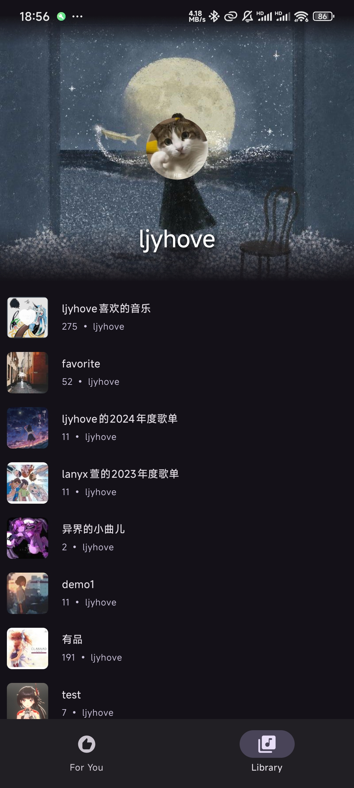

# Mei

一个网易云第三方音乐软件，软件仍然在开发中。

### 关于开发

**1.27** 已支持添加到歌单/删除音乐
**1.26** 喜欢音乐功能已完成

#### TODO
- 搜索功能
- 歌手主页
- 主页更多推荐
- 播放记录
- 优化性能

### 已实现

- 逐字歌词(网易云 && QQ音乐歌词)
- 播放列表
- 喜欢音乐
- 首页推荐

### 界面截图

  
  
  
  
  
  
  

