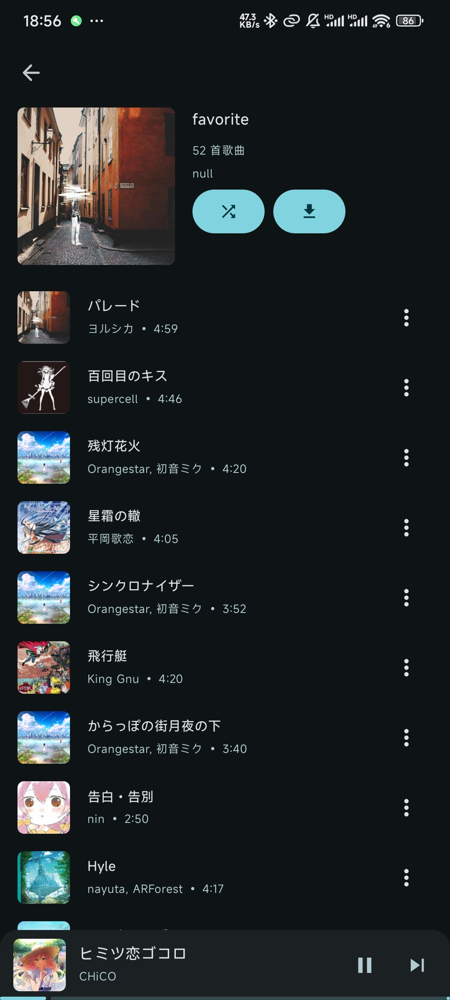

# Mei

一个网易云第三方音乐软件，软件仍然在开发中。但现阶段有很多bug和功能需要完善。

现在可以自己填写自己Cookie自行使用了, 只需要将Cookie中的MUSIC_U字段填到设置里面就行了

不过现在软件性能可能有点差，也可能来不及优化了。

因为上游项目除了一些问题，所以已经自写api实现了。
### 关于开发
**v1.25**. 尽管这个版本不是很满意，但是我已经无法将很多的精力用在它的开发上，但是它还是可以运行。
现在只能手动选择来QQ音乐的歌词，选择之后会记住不用二次选择。

测试有的bug就是，如果你切歌太快的话(再选择歌词)，歌词可能还是上一首的歌词，但是也可以再选择来一次会矫正。

所以你可能需要注意一下歌词是否和音频对的上。

还有就是软件有一个大额头，暂时没时间去处理。

添加到喜欢也还有bug，别点。正常播放音乐都是正常的。

其实可以用v1.23或者24版本，我感觉还不错的。

然后的话就是使用可能需要主要流量，因为本地没有做长期缓存，所以流量跑的特别快。

### 已实现
- 逐字歌词(网易云 && QQ音乐歌词)
- 播放列表
- 喜欢音乐
- 首页推荐

### 界面截图

  
  
  
  
  
  
  

